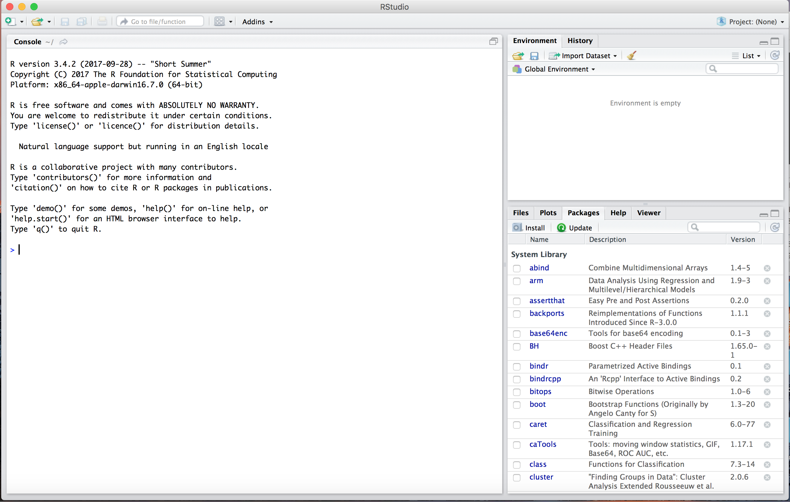
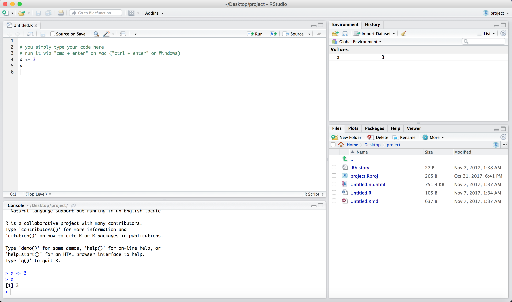
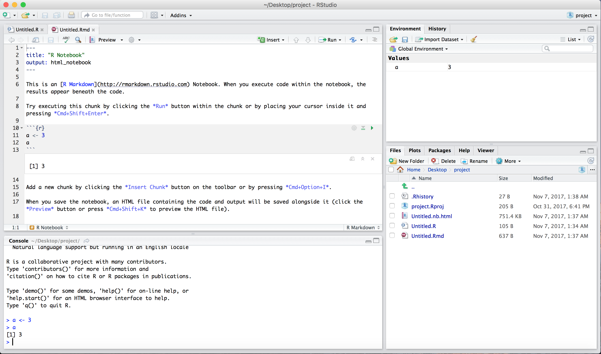

```{r setup, include=FALSE}
knitr::opts_chunk$set(echo = TRUE) #, eval = FALSE
knitr::opts_chunk$set(tidy.opts=list(width.cutoff=80),tidy=TRUE,comment ='>')
```

## R Installation

**First**, download and install **R** from *<https://cran.r-project.org/>*.

**Second**, download and install **RStudio Desktop** (Open Source License) from  *<https://www.rstudio.com/products/rstudio/download/>* (scroll down the web page to see download links).

R is a high-level programming language and environment for statistical computing. RStudio is a very useful and commonly used development interface built on top of R. Both are free. Both are available on Windows, Mac OS X, and Ubuntu. This tutorial uses R v3.4.2 and RStudio Desktop v1.1.383, but you can use more recent versions if available.

If you are having trouble with installation, try to Google the errors you are getting - very likely someone had similar issues to yours and there is a solution online. If you are still having trouble, reach out to the creators of the software.

After installation, both R and RStudio will be available in your installation directory. However, you do not need to use R directly yourself, RStudio uses it on your behalf, and you only directly interact with RStudio.

Now, proceed and launch RStudio.

## First steps

Once you have launched RStudio, you will see the following interface.

```{r echo=FALSE, out.width='100%'}

```

Create a project: File > New Project > Existing Directory > Browse ... > Create Project (the directory you pick will be your *working directory*)

Now, open new R script file: File > New File > R script

```{r echo=FALSE, out.width='100%'}

```

**Understand the layout**

1. Top left corner - text editor - you type all your code here and can then run selected code using Cmd + Enter (Mac) or Ctrl + Enter (Win).
2. Bottom left corner - console - this is where code is actually run and where output (including error messages) is shown.
3. Top right corner - list of defined variables and loaded data.
4. Bottom right corner - variety of windows. Plots will appear here under "Plots" tab. You can install packages and view already installed ones under the "Packages" tab. And you can type in names of functions under "Help" tab to find explanation of their operation.

Alternatively, we could use special R notebook (R markdown file) to mix code with text.

You could open it as follows: File > New File > R Notebook

```{r echo=FALSE, out.width='100%'}

```

R notebook allows you to mix together LaTeX equations, markdown notation, and R code, which is very useful when creating reports. In fact, this tutorial is written using R notebook format. The only peculiarity is that you need to mark R code in a special way as shown in the example. Then you can compile the notebook into one of several file formats and the code output will be embedded in text.

## R basics

Below I provide a review of some key functionality. However, there is much more to R, and there are many useful commands contained within specific packages. Use Google and stackoverflow to your advantage - R has great community - if there is a question you have - it was likely asked by someone and there is a response online. Learning how to find such information is an important skill for an R user.

```{r}
# hello world
print('Hello world')

# variable assignments (note, R convention for assignment is '<-'; but '=' will also work)
# also note that by default the numbers are class 'numeric'
a <- 3/2
a

class(a) # tells us the class of the object

# this is how you would create an integer -- rarely used
b <- as.integer(3/2)
b

class(b)

# what if we round a number to the lowest integer?
k <- floor(3/2)
k

class(k)

# and now to the highest integer
ceiling(3/2)
round(3/2)

# class character
class("s")

# turning numeric to character
as.character(3)

# and back
as.numeric('3')

# creating a vector of numbers
d <- c(1,2,4,5)
d

# notice, vector of numeric is class numeric too
class(d)

# creating a vector of strings 
k <- c(1,'dog',2,'a',4,6)
k

class(k)

# converting character vector to numeric - NA missing values introduced
as.numeric(k)

# checking for NA
is.na(as.numeric(k))

# logical values
k <- c(TRUE, FALSE, T, F)
k

class(k)

# sequences
1:10
seq(1,10)
seq(1,10,2) # odd numbers

# first element in a vector
d[1]

# second element in a vector
d[2]

# two ways to get the last element in a vector
d[length(d)]
tail(d,1)

# repeat vector three times
rep(d,3)

# repeat every element of a vector three times
rep(d,each=3)

# get unique elements
unique(rep(d,each=3))


sum(d) # sum of elements
prod(d) # product of elements
mean(d) # mean
sd(d) # standard deviation
var(d) # variance
sqrt(var(d)) # standard deviation

# log
log(d) # base e, also known as ln
log10(d) # base 10

# max value and index
max(d)
which.max(d)

# exp
exp(d)

# taking to power
d^2

# applying computation to a vector
sapply(d, function(x) x^2)

# factor - vector that assumes a discrete set of values (levels)
v <- rep(c('1990','2000','2010'),100)
v

v <- factor(v)
v

levels(v) # levels of a factor

as.numeric(v) # reveals numeric index corresponding to level ordering
as.numeric(as.character(v)) # recovers level labels


```

## Random numbers, matrices, and data frames
```{r}
# matrix of zeros
matrix(0,4,4)

# diagonal identity matrix
diag(5)

# matrix of zeros
m <- matrix(0,1,4)
v <- rep(0,5)

class(m)
class(v)

# conversion between matrices and vectors
as.matrix(v)
as.vector(m)

# set seed
set.seed(999)

# generate uniform [0,1] random variables
runif(5)

# generate standard normal random variables
rnorm(5)

# create a 12-number vector of uniform[0,1] random numbers and reshape it into 4x3 matrix
v <- runif(12)
v

class(v)

matrix(v,4,3)

# or filling by row
m <- matrix(v,4,3,byrow=TRUE)
m

class(m)

# mean of a matrix
mean(m)

# matrix transpose
t(m)

# matrix dot product
md <- m%*%t(m)
md

# matrix element-wise product
m*m

# multiplication by a scalar
10*m

# size of a matrix
dim(m)

# number of rows
dim(m)[1]

# number of columns
dim(m)[2]

# mean of each row
apply(m,1,mean)

# mean of each column
apply(m,2,mean)

# sum of each row
rowSums(m)
apply(m,1,sum)

# sum of each column
colSums(m)
apply(m,2,sum)

# first row of a matrix
m[1,]

# second column of a matrix
m[,2]

# specific element of a matrix
m[1,2]

# matrix inverse
solve(m[1:3,1:3])
```

## Lists

```{r}
# list of objects - unnamed
l1 <- list(5, "b", 12)
l1

# getting back a vector of elements in a list
unlist(l1)

# accessing element in a list - note special format
l1[[1]]

# named list
l2 <- list(a1=5, a2=c(2983, 1890), a3=c(3, 118))
l2

# getting named list value
l2$a1

# applying power to each element of a list
lapply(l2, function(x) x^2)

# unlisting named list
unlist(l2)

# taking mean over a list
mean(unlist(l2))

```

## Data frames

```{r}

# creating a data frame - list of vectors of the same length,
# it is structured like a table or matrix,
# individual variables are accessed via column names,
# individual observations - via row index
b1 <- c(NA, 22, 50)
b2 <- c("john", "rose", "john")
b3 <- c(TRUE, FALSE, TRUE)
df <- data.frame(b1, b2, b3)

# here is how we access columns
df$b1
df$b2

# note that a vector of strings was automatically converted into a factor
# when data frame was created
class(df$b2)

# if we do not want to convert string vectors to factors when creating a data frame,
# we simply add stringsAsFactors=FALSE option
df <- data.frame(b1, b2, b3, stringsAsFactors=FALSE)

class(df$b2) # now it is character

# renaming columns (variables) of a data frame
colnames(df)
colnames(df) <- c('age','name','indicator')
colnames(df)

# second row
df[2,]

# second element of the indicator variable
df$indicator[2]
df[2, "indicator"]
df[2, 3]

# slicing - two first rows and two names columns
df[1:2, c("age","indicator")]

# picking out elements of data frame based on two vectors of coordinates
df[cbind(1:2, c(1,3))]

# filtering for rows that contain name "john" in name column
df[df$name=="john",]

# keeping rows without missing values in age column
df[!is.na(df$age),]

# binding data frames together
rbind(df,df) # horizontally
cbind(df,df) # vertically

# description statistics
df <- data.frame(a=runif(10), b=runif(10), c=runif(10))

# mean
apply(df,2,mean)

# variance
apply(df,2,var)

# standard deviation
apply(df,2,sd)

```


## Loops, if-else statements, functions, vectorization

```{r}

# loop
for (i in 1:5) {
  print(i)
}

# conditional statements
if (a > 1) {
  print('hi')
} else if (a > 0) {
  print('hello')
} else {
  print('bye')
}

# function
custom_mean <- function(v) {
  # taking mean over a vector via a for-loop
  temp <- 0 
  for (i in v) {
    temp <- temp + i
  }
  return(temp/length(v))
}

v <- runif(1000000)

custom_mean(v)
mean(v)

# which one is faster?
s <- Sys.time()
custom_mean(v)
e <- Sys.time()
e-s

s <- Sys.time()
mean(v)
e <- Sys.time()
e-s

# as we see, native mean() function, which applies to an array as a whole, is much faster -
# loops, which access arrays elementwise, are very slow in R - avoid them at all costs!
# using mean() function instead of looping over an array is an example of vectorization -
# vectorize everything using R expressions - e.g., apply(), linear algebra notation, etc.

# vectorization is fast because R functions are often just an interface to fast low-level language code - 
# for example, fast fourier transform calls C code
# (we can print content of the function by typing it without round brackets)
fft

# and here is how you can get help on the function
?fft
```

## Loading packages

Note, you need to install the following packages before we can load and use them:

- "gdata" - handles data loading
- "ggplot2" - visualization
- "ggthemes" - visual themes for plots
- "scales" - helps with scale plotting
- "arm" - plotting regression coefs

One way to do it is to go into *Packages* tab in the bottom right window of RStudio, click install, enter package name, and press enter (you can also update packages from this tab). Alternatively, you can use *install.packages(c("gdata","ggplot2","ggthemes","scales","arm"))* command.

```{r}
# Note, you need to install packages below before loading them
# install.packages(c("gdata","ggplot2","ggthemes","scales","arm"))

suppressMessages(library("gdata")) # loads library and suppresses unnecessary output
library("ggplot2")
library("ggthemes")
library("scales")
suppressMessages(library("arm"))
```

## Downloading and loading data

```{r}
# the project is based on rolling sales update provided by NYC
# http://www1.nyc.gov/site/finance/taxes/property-rolling-sales-data.page

# data for Manhattan in excel format is available via this link
# http://www1.nyc.gov/assets/finance/downloads/pdf/rolling_sales/rollingsales_manhattan.xls

# download the data (5.3MB)
download.file("http://www1.nyc.gov/assets/finance/downloads/pdf/rolling_sales/rollingsales_manhattan.xls", destfile="manhattan_real_estate.xls")

# load xsl file into a data frame - this will take a moment
data <- read.xls("manhattan_real_estate.xls", header=TRUE, pattern="BOROUGH")

# do ?read.xls and you will find that 'pattern' requires that all lines are skipped before the requested pattern is found

# NOTE: the exact numerical results shown below will change over time, as sales log gets updated
```

## Data cleaning
```{r}
# data frame
class(data)

# size of data
dim(data)

# names of columns - could be overwritten if desired
colnames(data)

# see top 5 rows of the data
head(data, 5)

# what class?
class(data$SALE.PRICE)
class(data$YEAR.BUILT)

# transform factor into numeric
data$YEAR.BUILT <- as.numeric(as.character(data$YEAR.BUILT))

# transform factor into numeric, removing commas and dollar signs on the way
data$SALE.PRICE <- as.numeric(gsub("\\$ ","",gsub(",","",as.character(data$SALE.PRICE))))

# transform into factor to make it a categorical variable
data$TAX.CLASS.AT.TIME.OF.SALE <- as.factor(data$TAX.CLASS.AT.TIME.OF.SALE)

data <- data[!is.na(data$YEAR.BUILT),] # remove observations with a missing year of construction
data <- data[data$YEAR.BUILT>=1900,] # only keep observations after 1900
data <- data[data$SALE.PRICE>0,] # filter out zero prices (e.g., due to inheritance/gifts)

# check size of the data again
dim(data)

# we could now save the data, dropping row index
write.csv(data,file='clean_data.csv',row.names=FALSE)

# and here is how we could read it back in
head(read.csv(file = "clean_data.csv", head=TRUE))
```

## Basic distribution statistics
```{r}
median(data$SALE.PRICE) # median sales price
mean(data$SALE.PRICE) # mean 
max(data$SALE.PRICE) # max

aggregate(cbind(YEAR.BUILT, SALE.PRICE) ~ TAX.CLASS.AT.TIME.OF.SALE, data=data, FUN=median) # get median of variables by group
aggregate(cbind(YEAR.BUILT, SALE.PRICE) ~ TAX.CLASS.AT.TIME.OF.SALE, data=data, FUN=length) # count of rows within each group

# other libraries to explore on your own - plyr, dplyr, reshape2, lubridate
```

## Histogram
```{r}
# simple sales price histogram (log-transformed)
hist(log10(data$SALE.PRICE))

# ggplot2 sales prices histogram
ggplot(data, aes(SALE.PRICE)) + geom_histogram(aes(fill=..count..),alpha=0.6,bins=50) +
  theme_bw() + ggtitle("Histogram of Property Sales, Manhattan", subtitle = NULL) + 
 scale_fill_gradient("Count",low="orange",high="red") + scale_y_continuous("Count") +
  scale_x_log10(breaks = scales::trans_breaks("log10", function(x) 10^x),
   labels = scales::trans_format("log10", scales::math_format(10^.x)) ) + 
  xlab("Sales Price (log-scaled)")
```

## Running a regression
```{r}
# pearson (linear) correlation between logged prices and year when the building was constructed
cor(log10(data$SALE.PRICE),data$YEAR.BUILT)

# spearman rank-order correlation (here log transformation would not change results because correlation is measured in terms of rank orderings, and log preserves order)
cor(data$SALE.PRICE,data$YEAR.BUILT, method="spearman")

# run simple regression
model <- lm(data=data, log10(SALE.PRICE) ~ YEAR.BUILT)

# plot summary of estimates
summary(model)

# we can interpret the regression results as follows
# if we increase construction year by 1, e.g. from 2000 to 2001,
# we increase log10(sales price) by value of coefficient YEAR.BUILT: 0.0014371 (the exact value may change as data gets updated),
# that is, we increase sales price by 100*(10^0.0014371-1) = 0.33%
# see details on interpretation here: http://www.cazaar.com/ta/econ113/interpreting-beta
```

## Plotting a regression line
```{r}
# plot regression line - relationship between log10(sales price) and year built
# color points by tax class
p <- ggplot(data, aes(YEAR.BUILT,SALE.PRICE,color=TAX.CLASS.AT.TIME.OF.SALE)) + 
  geom_point(alpha=0.3) + 
  theme_bw() + xlab("Year of Construction") + scale_y_log10(
   breaks = scales::trans_breaks("log10", function(x) 10^x),
   labels = scales::trans_format("log10", scales::math_format(10^.x)) )

# add regression line
# setting intercept of the line based on beta0, slope of the line based on beta1
p + geom_abline(intercept = coef(model)[1], slope = coef(model)[2]) + 
# annotating
annotate(label = sprintf("log10(y) = %.5f + %.5fx\nR² = %.3f", coef(model)[1],coef(model)[2],  summary(model)$r.squared), geom = "text", x = 1975, y = 10^8, size = 4)
```

## Regression diagnostics
```{r}
# regression diagnostic plots - 
# notice, for example, that qqplot shows deviations from assumption that
# residuals are normally distributed - so we should take care interpreting 
# the p-values and statistical significance results
plot(model)
```

## Plotting numerous regression coefficients
```{r}
# finally, let us build a large model with dummy variables and 
# visualize its coefficients and confidence intervals
model <- lm(data=data, log10(SALE.PRICE) ~ YEAR.BUILT + NEIGHBORHOOD)
names(model$coefficients)<-gsub('NEIGHBORHOOD','',names(model$coefficients))
summary(model)
coefplot(model,mar=c(0.5,20,2,5), main="") # bottom, left, top, and right margins
```
